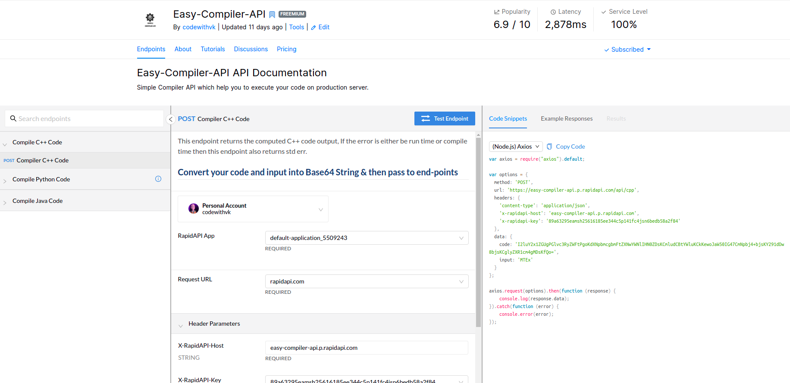

# Easy-Compiler-API

  
  
🚀  Open Source Compiler API which help you by compile your code on production envierment. ✡️ 

## Important

  

  
#### [API Reference](https://rapidapi.com/codewithvk/api/easy-compiler-api/)
 - If you want fast performance or you do it at a low cost, then we recommended cloning this repo and run on your own cloud.
 - Don't forget to give 🌟 Star  🌟 to a repository.

### Programming Language 
- [x] CPP
- [x] Python
- [x] Java 

 Fun Fact 😉 :- You can deploy it on free cloud provider(heroku) |:)
